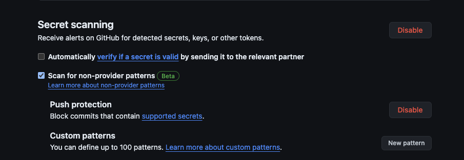
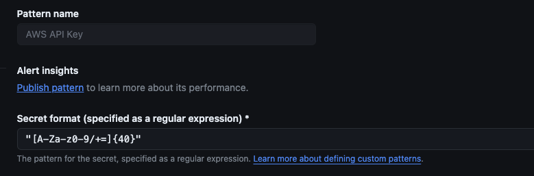
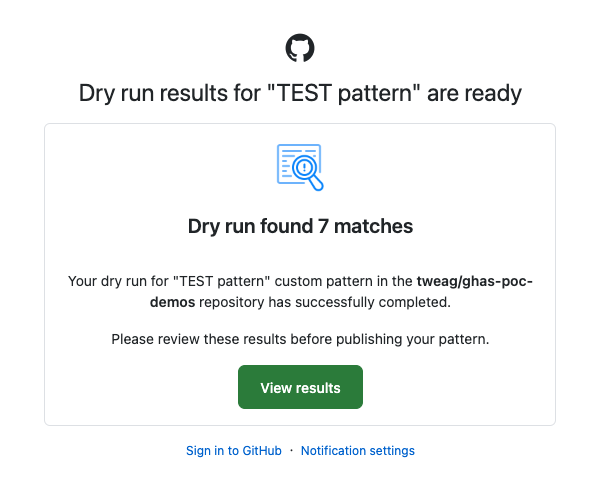
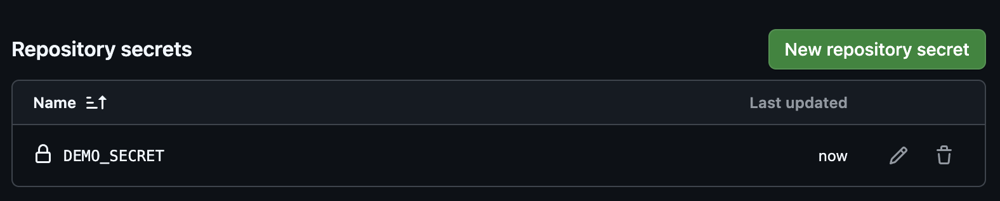
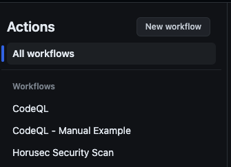
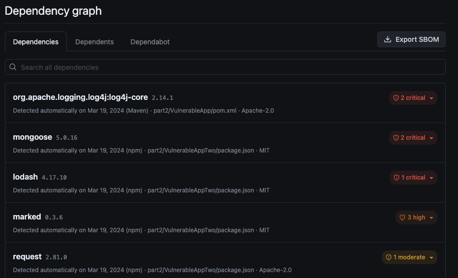
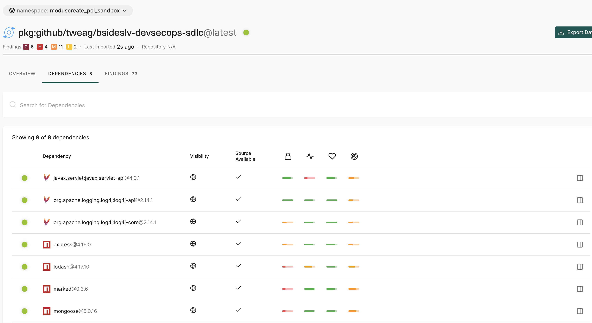

# Demo 1 - Application Security and GHAS for Developers

For this part of the workshop we've provide a vulnerable JS application and a package.json and an environment file to work with.

We will start by looking at how secrets scanning tools can be used against these files.

## GitHub Native Secrets Scanning
GitHub provides us with an built-in mechanism to scan for secrets. This includes the ability to scan for custom patterns as well as common key formats, such as AWS API keys.

Configuration of Secrets scanning in GitHub, including the configuration of custom patterns is found under `Settings > Code security and analysis`. Your company may have enabled this across the whole organization by default, but it is useful to see how this works under the hood.



We are going to create an example rule that detects Cloud infrastructure keys

This regex will detect pattersn such as our AWS API key and then add an alert to the `Security` tab.

GitHub allows us to autogenerate regex patterns. We can see how this works by clicking the `Generate with AI` button. 

In this particular example we are going to use a pre-canned regex to demonstrate how the detections work. 

Select the `New pattern` option and then use the following regex to test for AWS API keys

```console

"[A-Za-z0-9/+=]{40}"

```

Make sure you also give the pattern a useful name so you know what it does. 



If you want to test the regex, you can do this by pasting in our dummy example key from `vuln.ini`  and creating a dry run.

The dry run will be queued up and you will receive an email when a leaked secret is detected.



You may notice some false positives in here, this is where you need be careful in constructing your own detections. 

Select the `Publish pattern` button. Congrats, you have now added your own custom secrets detection.

We can find detected secrets under the `Security > Secret scanning` option. Switch to this screen.

If you select the detection finding, you will find some helpful information including:

1. The finding itself

2. Remediation steps

3. The detected location
 

You may have noticed that GHAS has also automatically picked up this API key, as well as some other leaked credentials. As GHAS detection abilities continue to grow, you can expect the `AI detection of additional secrets` features to improve! 

If you wish, you can remove the key from your forked repository and commit and push the change. Remember in a real world scenario you would need to rotate the leaked key!

Re-visit this screen and then choose an option from the `Close as` drop down to close out the finding, for example `Revoked`

Congrats, you've written a detection rule and closed out a finding.


## Handling secrets in GitHub

We can avoid hard coding secrets into files through using a secrets manager. GitHub comes with one which can be accessed under 

`Settings > Secrets and variables > Actions`

We can create a new secret for our project by selecting the `New repository secret` button.

Give you secret a name e.g. `demo_secret`.

Add a `Secret` - let's use something simple like `password` for this example. Of course, this is not a good option for a real life password!

This secret should now be visibile:




This secret can be used now in Actions pipelines, to avoid having to hard code it into a file. Obviously as we have just demonstrated we want to avoid hard coding passwords and similar into our applications. If we do, then the secrets scanning tool should flag them.

Let's try this out, calling our secret from an action. 

Create a new Action in your `.github/workflows` directory called `usingsecrets.yml`. To this file add the following code:

```yaml

name: Example Using Secrets

on:
  push:
    branches:
      - main
  pull_request:

jobs:
  secrets:
    runs-on: ubuntu-latest
    name: Demo Using Secrets
    steps:
    - name: Echo Out The Secret
      env:
        demo1_secret: ${{ secrets.demo_secret }}
      run: echo "$demo1_secret"

```

Commit this and push it up to GitHub, and then check out the Actions tab.

You will see that it executed. A nice feature is, Actions is smart enough to prevent the `echo` statement from leaking our password:

```console
Run echo "$demo1_secret"
***
```

Our password in this example has been replaced with `***`.

So that's a basic guide to how we can detect secrets from GitHub's native tooling as well as use GitHub's secrets storage mechanism.

We will now take a look at how we can detect security vulnerabilities across our code base. 

## Detecting secutity vulnerabilities 

GitHub supports a number of mechanisms for handling security vulnerabilities including:

1. SAST

2. Dependency Analysis

3. Secrets scanning 

4. SBOMS

We can also add a security policy to our repository so that contributors know how to responsibly report findings. To do this, navigate to the `Security` tab.

From here we can select the `Set up a security policy` button. Next select the `Start setup` button.

Let's add a dummy policy in. You can add anything you like for now.  

Save this.

If you return to the `Security overview` you will now see the `Security policy` is enabled

That was pretty simple! Let's move onto seeing how we can detect vulnerabilities.


## Vulnerable dependencies 

In the forked repository you will notice that a pull request has been created. This is because GitHub has detected we have a vulnerable dependency in our`package.json` file.

Click on the first pull request in the list, and you can find more information.

We can see that merging this pull request fixes `6` dependabot alerts in relation to `lodash`:

1. Bump lodash from 4.17.10 to 4.17.21 in /demo1 

2. Bump mongoose from 5.0.16 to 5.13.20 in /demo1

3. Bump express from 4.16.0 to 4.19.2 in /demo1

If you merge in this PR it will fix the issue. If you are unfamiliar with this concept, GitHub provides an overview here: https://docs.github.com/en/code-security/dependabot/working-with-dependabot/managing-pull-requests-for-dependency-updates

Later in this workshop we will be looking at how you can extract the list of dependencies as an SBOM. Now we have fixed vulnerabilities in our repository, let's take a look at the application source code again.

Dependabot allows you to overirde the default configuration and add your own YAML file. You can find documentation on this at:

https://docs.github.com/en/code-security/dependabot/dependabot-version-updates/configuration-options-for-the-dependabot.yml-file

Here you can update setting such as the location of package manifests relative to the root of the repository.

```yaml

# Specify location of manifest files for each package manager

version: 2
updates:
  - package-ecosystem: "composer"
    # Files stored in repository root
    directory: "/"
    schedule:
      interval: "weekly"

  - package-ecosystem: "npm"
    # Files stored in `app` directory
    directory: "/app"
    schedule:
      interval: "weekly"

  - package-ecosystem: "github-actions"
    # Workflow files stored in the default location of `.github/workflows`. (You don't need to specify `/.github/workflows` for `directory`. You can use `directory: "/"`.)
    directory: "/"
    schedule:
      interval: "weekly"

```

Let's now take a look at how we can run SAST scans in GitHub.

## Static Analysis

In this example we have enabled CodeQL by default in this repository. Let's take a look at the configuration.

Go to the `Actions` tab in GitHub and you will see there are two CodeQL workflows.



When setting up CodeQL you can manually add a file (Advanced configuration mode) or configure it with default values directly in GitHub.

The default settings will scan the `main` and `protected` branches. However you may wish to expand this to cover other non-protected branches for example.

From the workflows list, the top item is an example of one that was created directly in GitHub wthout adding a `codeql.yml` file.

The next one down, uses the `codeql.yml` file.

Let's see if CodeQL has detected any vulnerabilities. Navigate to:

`Security > Code Scanning`

Under this option you should see listings, for example:

`Database query built from user-controlled sources`

This was detected in `src/index.js` on line `33`.

If you open up the finding, you will see it has flagged:

```javascript
     const user = await User.findOne({ username: username, password: password });
```

Expanding the finding will show a large amount of detail around the issue including:


1. A description

2. A recommendation 

3. An example 

4. Some references for further reading.

There are multiple fixes you can try in the list to resolve the issue. 

If this was a false positive we could select a value from the `Dismiss alert` drop down. Or, if we wantd to create a backlog item to fix the issue 
we can create a new GitHub Issue using the button in the top right.

Try selecting one of the fixes. Apply it to your code locally and commit and push it back up to GitHub. Did this resolve the issue?

We've now seen how we can use SAST in GitHub, let's take a look at how we can prevent code being merged into branches unless a user has permission, or our SAST scans are successful.


## Branch protection rules

The `main` branch represents our mainline of development, and would likely be deployed to a production envrionment. It is therefore important that only certain users have permission to add code to it, and also that the code that is merged in is clean and free of security vulnerabilities. 

We can protect our `main` branch through a couple of mechanisms. You should see a message similar to this, within your forked repo:

```console
Your main branch isn't protected

Protect this branch from force pushing or deletion, or require status checks before merging. View documentation.
```

The first option is to select the `Protect this branch` button from the repository next to the above message.

The second option is to configure the branch protection rule through the settings. To do this, follow these steps:

1. Select `Settings` from the top menu

2. On the left select `Branches`

3. You should see a button called `Add banch protection rule`

4. When you select this, a menu will load. 

5. You can set the `Branch name pattern` to `main`

6. Select `Require a pull request before merging`

7. Next select `Require status checks to pass before merging`

8. Select `Create`

We now have rules in place that force a pull request and all checks to pass before merging.

We can also ensure that only certain users and groups in GitHub can merge to certain branches. This is achieved through adding a `CODEOWNERS` file.

You can learn more about these here:

https://docs.github.com/en/repositories/managing-your-repositorys-settings-and-features/customizing-your-repository/about-code-owners

When the file is added, then individuals/groups listed in the `CODEOWNERS` files will be tagged with a request to review the pull request.

Adding the file is simple. In the `.github` directory within your repository, add the file:

```console

touch .github/CODEOWNERS

```

Open this file in your editor and add the following:

```console

# When someone opens a pull request that
# modifies JS files, your user will be requested for a review.
*.js    @my-user

```
Replace `@my-user` with your GitHub user.

Commit this change and push it to the remote repository.

We can now return to our branch protection rules and edit them to also use the `CODEOWNERS` file.

Include the requirement `Require review from Code Owners`

Well done, you've just completed a basic guide to how you can enforce checks on branches to improve security in the SDLC.

Let's now take a look at Software Bill of Materials (SBOM).

## SBOMs (Software Bill of Materials)

Our final task is going to be to extract the SBOM from our project. An SBOM is a nested inventory of the components within an application. You can think of it as an ingrediants list of sorts. US government aegencies are now mandated to obtain an SBOM from their software vendors and internal engineering teams in order to validate the products security. So being familiar with the term and process is helpful. 

Within GitHub the SBOM can be found under `Insights > Dependency graph`.

You'll notice on this screen that if you haven't fixed any of the security issues associated with dependencies these will be flagged.



We can extract the SBOM by selecting the `Export SBOM` button on the top left. This will download a JSON file to your local machine.

Here's an example of what part of the file looks like

```json

{"SPDXID":"SPDXRef-DOCUMENT","spdxVersion":"SPDX-2.3","creationInfo":{"created":"2024-03-20T18:26:13Z","creators":["Tool: GitHub.com-Dependency-Graph"]},"name":"com.github.tweag/ghas-poc-demos","dataLicense":"CC0-1.0","documentDescribes":["SPDXRef-com.github.tweag-ghas-poc-demos"]

...

{"relationshipType":"DEPENDS_ON","spdxElementId":"SPDXRef-com.github.tweag-ghas-poc-demos","relatedSpdxElement":"SPDXRef-actions-github-codeql-action-init-3.*.*"}]}

```

You can open your file in an IDE to see the whole JSON object.

This file contains a list of the dependencies in SPDX format. You can read more about this here:

https://spdx.dev/

This open standard for SBOMs contains information on:

1. Name

2. Version

3. Components

4. Licenses

5. Copyrights

6. Security references


SBOMs can be ingested into a variety of tools to demonstrate that the composition of your application is secure. For example, it can demonstrate to a third party that vulnerable dependencies have been upgraded.

You can find tools for working with SPDX format SBOMs at the spdx.org website https://tools.spdx.org/app/

SBOMs can be ingested into Endor Labs (https://www.endorlabs.com)

Their platform has an `SBOM Hub` feature for managing your SBOMs. Additionally it will enrich your SBOM with VEX data.





Now you know how to generate an SBOM, you've reached the end of this demo!
